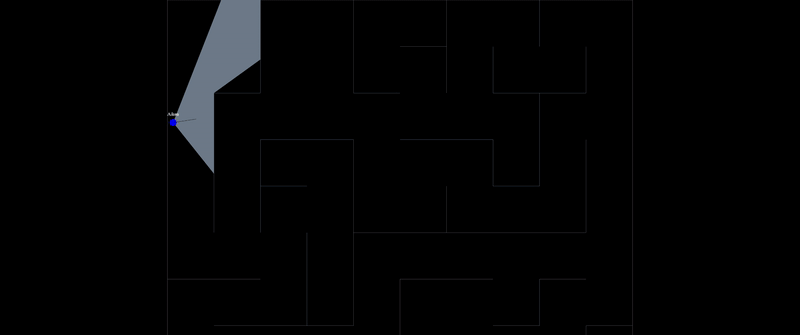

# Maze Royale

A lobby-based Battle Royale game set within a randomly generated maze-like map. Built using Socket.IO and HTML5 Canvas.

Play it [here](https://maze-royale.netlify.app/).

## Mechanics (TODO)

- Fog of war: Players are only able to see objects within a limited field of view.
- Aiming: Players can aim by holding down the right mouse button. While aiming,
  - Camera will move more towards the mouse position, allowing the player to see objects further away.
  - Shot spread is reduced (not implemented yet).
  - Movement speed is reduced (not implemented yet).
  - Field of view is greatly reduced.
